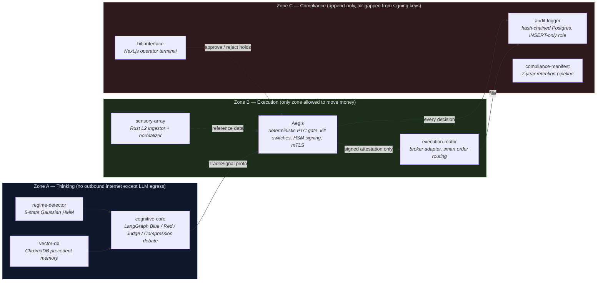

<div align="center">


[](https://github.com/alijendoubi/agentic-fintech-ecosystem/actions/workflows/ci.yml)


</div>


## What this is

A greenfield attempt at a **sovereign, three-zone autonomous trading system**: an LLM debate produces a trade
hypothesis, a deterministic risk gate decides whether it is allowed to exist, and every decision is logged in a way
that cannot be quietly edited afterward. It targets US equities, with MiFID II / DORA / EU AI Act considerations
carried as drafts, not compliance claims.

The design principle that matters most: **the language model never touches money.** It can only propose. A separate,
boring, deterministic Rust service — Aegis — is the only thing allowed to sign an order, and it fails closed on
anything it cannot verify.

## Architecture



Full package-by-package status, what's real versus placeholder, and exactly which commands were run and when:
**[`agent-core/README.md`](agent-core/README.md)**.

## Why it's built this way

| Decision | Reasoning |
|---|---|
| LLM proposes, never signs | A hallucination should produce a rejected proposal, not a filled order. |
| Aegis is Rust, not Python | The risk gate needs a deterministic, auditable, fast (<50ms target) decision path — no GC pauses, no dynamic dispatch surprises. |
| Money is fixed-point `int64` nanos | `f64` for money is a defect class this project refuses to ship. |
| Audit log is hash-chained, INSERT-only | A compromised app role must not be able to rewrite history, only get caught changing it. |
| Everything fails closed | Missing state, an unreachable dependency, or an unverifiable signature all resolve to "do nothing," never "assume it's fine." |

## Repository layout

```
agent-core/
├── zone-a/            cognitive-core · regime-detector · vector-db      (Python)
├── zone-b/            sensory-array · aegis · execution-motor           (Rust + Python)
├── zone-c/            audit-logger · compliance-manifest · sharp-gate · hitl-interface  (Python + TypeScript)
├── backtesting/       event-driven engine, walk-forward analysis, Monte Carlo
├── shared/proto/      protobuf contracts (buf-linted, breaking-change checked)
├── infrastructure/    docker-compose.yml, docker-compose.dev.yml, .env.example
└── docs/              specs, ADRs, regulatory drafts, runbooks — read the caveats on each
```

## Getting started

Every package is independently buildable and testable; there is no single "run the app" command because the
end-to-end path isn't wired yet. Start with the package you care about:

```bash
# Rust (Aegis, sensory-array) — via a container with protoc/clippy pinned
cd agent-core/zone-b/aegis && cargo fmt --check && cargo clippy --all-targets -- -D warnings && cargo test

# Python packages — each has its own requirements-dev.txt
cd agent-core/zone-b/execution-motor && pip install -r requirements-dev.txt && python -m pytest

# HITL operator terminal (Node >= 20.9)
cd agent-core/zone-c/hitl-interface && npm ci && npm run typecheck && npm run lint && npm test

# Validate the compose topology without starting anything
cd agent-core/infrastructure && docker compose config
```

The full, per-package command reference — including which ones have actually been run and what their last verified
result was — lives in [`agent-core/README.md`](agent-core/README.md#quick-start).

## Documentation

| | |
|---|---|
| 📐 Specs | [`agent-core/docs/specs/`](agent-core/docs/specs) — phases 0 through 5 |
| 🧭 Architecture decisions | [`agent-core/docs/adr/`](agent-core/docs/adr) — two Accepted, two still Proposed |
| ⚖️ Regulatory drafts | [`agent-core/docs/regulatory/`](agent-core/docs/regulatory) — **not legal advice, not a compliance claim** |
| 🛠️ Runbooks | [`agent-core/docs/runbooks/`](agent-core/docs/runbooks) — drafted, never drilled |
| 📋 Promotion process | [`agent-core/docs/processes/sharp-promotion.md`](agent-core/docs/processes/sharp-promotion.md) |

## License

No license file is currently committed to this repository. In its absence, default copyright applies: no one but the
owner has permission to copy, modify, or distribute this code. This is a gap to close before any public use, not an
implicit grant of rights.

<div align="center">

</div>
